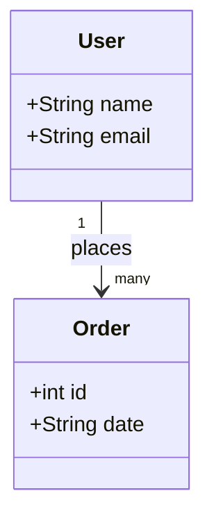

# Project Template for Codespaces

This is a basic Python template for building Python projects, specifically microservices. The readme is opinionated, but you don't necessarily need to follow its guidance. 

## 1. Creating a Virtual Environment

To create a virtual environment using a `.venv` folder:

```bash
python -m venv .venv
```

Activate the virtual environment:

- **For Unix or MacOS:**
    ```bash
    source .venv/bin/activate
    ```

## 2. Freezing Python Libraries to a requirements.txt File

To freeze your current Python libraries:

```bash
pip freeze > requirements.txt
```

## 3. Basic Pythonic Guide

- Follow the [PEP 8 style guide](https://peps.python.org/pep-0008/).
- Use meaningful variable names.
- Write docstrings for your functions and classes.
- Avoid complex nested code; break it into smaller functions.

## 4. Suggested Project Structure

```
project/
│
├── src/
│   └── main.py
│
├── infra/
│   └── pulumi/
│       └── Pulumi.yaml
│
├── .devcontainer/
│   ├── Dockerfile
│   └── devcontainer.json
│
├── docs/
│   └── architecture.md
│
├── requirements.txt
└── README.md
```

## 5. Overview of Domain-Driven Design

Using Mermaid and C4 architecture to document:



## 6. Overview of Ports and Adapters Pattern (Hexagonal Architecture)

Hexagonal architecture in Python focuses on:
- Core domain logic (inside hexagon)
- External dependencies (outside hexagon)

Example structure:

```
project/
│
├── core/
│   └── service.py
│
├── adapters/
│   └── repository.py
│
├── entrypoints/
│   └── api.py
```

## 7. Using CloudEvents and Event Store

To use CloudEvents in Python:

```python
from cloudevents.http import CloudEvent, to_structured
```

To model events:

```python
event = CloudEvent(attributes, data)
headers, body = to_structured(event)
```

## 8. The 12-Factor App for Python Microservices

1. Codebase: One codebase tracked in revision control.
2. Dependencies: Explicitly declare dependencies.
3. Config: Store config in the environment.
4. Backing services: Treat backing services as attached resources.
5. Build, release, run: Strictly separate build and run stages.
6. Processes: Execute the app as one or more stateless processes.
7. Port binding: Export services via port binding.
8. Concurrency: Scale out via the process model.
9. Disposability: Maximize robustness with fast startup and graceful shutdown.
10. Dev/prod parity: Keep development, staging, and production as similar as possible.
11. Logs: Treat logs as event streams.
12. Admin processes: Run admin/management tasks as one-off processes.

## 9. Using Flask for Creating APIs

To create a simple Flask API:

```python
from flask import Flask

app = Flask(__name__)

@app.route('/')
def hello():
    return "Hello, World!"

if __name__ == "__main__":
    app.run(host='0.0.0.0', port=8000)
```

## 10. Bundling Software into a Docker Container

Create a `Dockerfile`:

```Dockerfile
FROM python:3.12-bookworm

WORKDIR /app
COPY requirements.txt .
RUN pip install -r requirements.txt
COPY . .
CMD ["python", "src/main.py"]
```

Build and run the Docker container:

```bash
docker build -t myapp .
docker run -p 8000:8000 myapp
```

## 11. Packaging Python Application for Releases

Use `setuptools`:

```python
from setuptools import setup, find_packages

setup(
    name="myapp",
    version="0.1",
    packages=find_packages(),
)
```

Create a `setup.py` and build:

```bash
python setup.py sdist bdist_wheel
```

## 12. GitHub Action for Build and Deployment

Create a `.github/workflows/ci-cd.yml` file:

```yaml
name: CI/CD

on:
  push:
    branches:
      - main

jobs:
  build:
    runs-on: ubuntu-latest

    steps:
    - name: Checkout code
      uses: actions/checkout@v2

    - name: Set up Python
      uses: actions/setup-python@v2
      with:
        python-version: '3.x'

    - name: Install dependencies
      run: |
        python -m pip install --upgrade pip
        pip install -r requirements.txt

    - name: Build Docker image
      run: |
        docker build -t myapp .

    - name: Push to Docker Hub
      run: |
        echo "${{ secrets.DOCKER_PASSWORD }}" | docker login -u "${{ secrets.DOCKER_USERNAME }}" --password-stdin
        docker tag myapp:latest mydockerhubusername/myapp:latest
        docker push mydockerhubusername/myapp:latest
```

## 13. Writing a Great README for a Microservice

Include the following sections:
- **Project Title:** Concise and descriptive.
- **Description:** Brief overview of the project and its purpose.
- **Installation:** Steps to install dependencies and set up the project.
- **Usage:** How to run the project and basic usage instructions.
- **API Reference:** Detailed API documentation.
- **Contributing:** Guidelines for contributing to the project.
- **License:** License information.

Example:

```markdown
# My Microservice

## Description
This microservice provides an API for managing users and orders.

## Installation
Clone the repository and install dependencies:

```bash
git clone https://github.com/yourusername/yourrepository.git
cd yourrepository
python -m venv .venv
source .venv/bin/activate
pip install -r requirements.txt
```

## Usage
Run the application:

```bash
python src/main.py
```

## API Reference
### GET /users
Returns a list of users.

### POST /users
Creates a new user.

## Contributing
Reach out to Shawn if you want to contribute.


